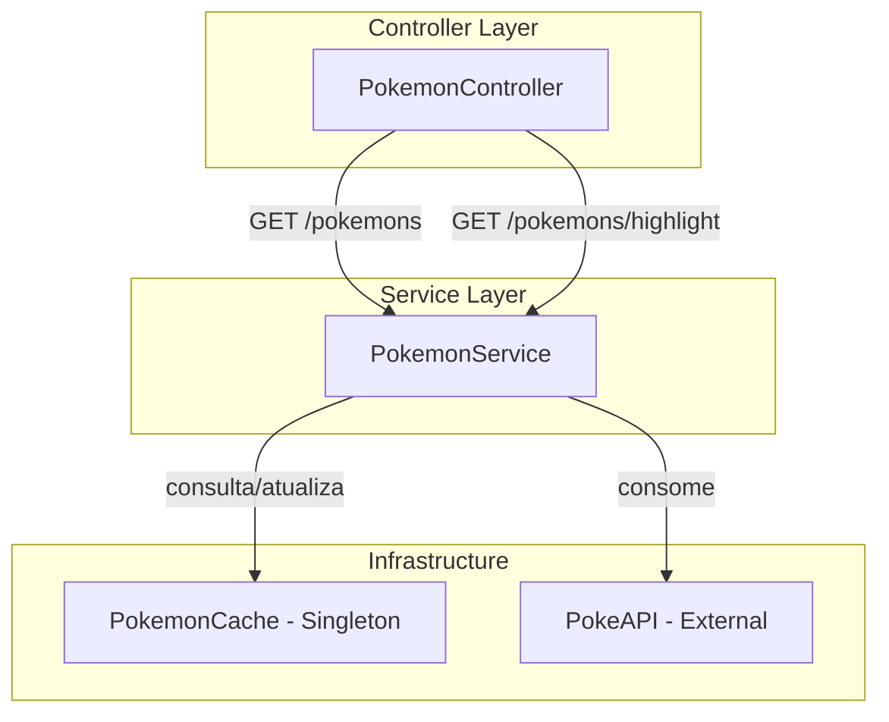

```mermaid
flowchart TD
    %% Camada de Apresentação
    subgraph "Controller Layer"
        PC[PokemonController]
    end

    %% Camada de Serviço
    subgraph "Service Layer"
        PS[PokemonService]
    end

    %% Camada de Infraestrutura
    subgraph "Infrastructure"
        PCache[PokemonCache - Singleton]
        PAPI[PokeAPI - External]
    end

    %% Endpoints do Controller
    PC -- "GET /pokemons" --> PS
    PC -- "GET /pokemons/highlight" --> PS

    %% Serviço consome cache e API externa
    PS -- "consulta/atualiza" --> PCache
    PS -- "consome" --> PAPI
```
